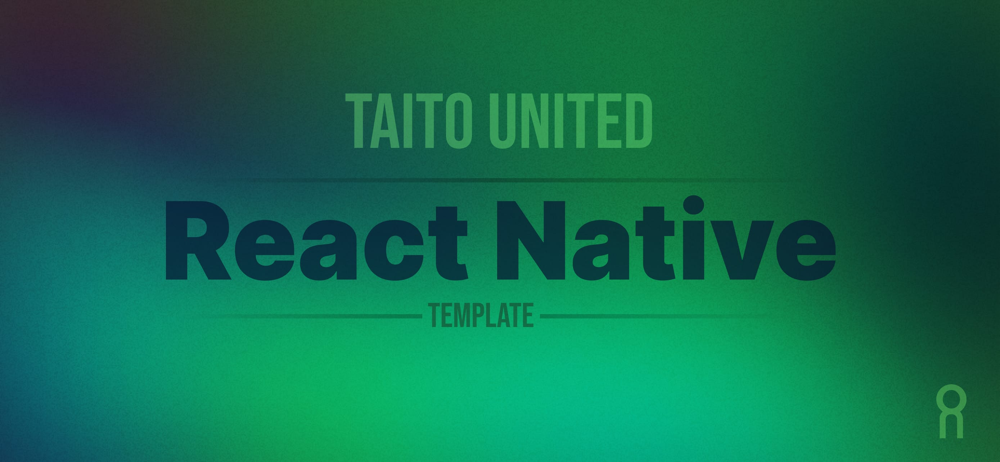

  

# React Native template

Project template for mobile app projects using React Native and Expo.

## Starting a new project

After you have cloned this repo to start a new mobile app project go through the following steps to customize the template based on your project needs.

### Update app metadata

Update the following fields in the `config/app.config.ts`:

1. `name` (name of the app)
2. `appSecret` (in `with-appcenter` plugin options - you need to have App Center projects setup for both iOS and Android versions of the app)
3. `slug` (this is really not used but Expo requires it)

### Setup a design system

1. If you don't have a design system yet clone the [Design System Template](https://www.figma.com/file/vEO1Adp6j0nHiiq9BiexE1/Design-System-Template) project in Figma.
2. Update the design tokens (colors, typography, etc.) to match your project design and branding.
3. Add your own app icon and splash screen in the **App Icon & Splash** page.
4. Run `npm run design-system:sync` in the terminal.

TODO: add more info here...

## Project documentation

- [Development](/docs/DEVELOPMENT.md)
- [Assets (icons, fonts, etc.)](/docs/ASSETS.md)
- [Design System](/docs/DESIGN_SYSTEM.md)
- [Localization](/docs/LOCALIZATION.md)
- [Code Signing](/docs/CODE_SIGNING.md)
- [App Center](/docs/APP_CENTER.md)
- [Publishing to stores](/docs/PUBLISHING.md)
